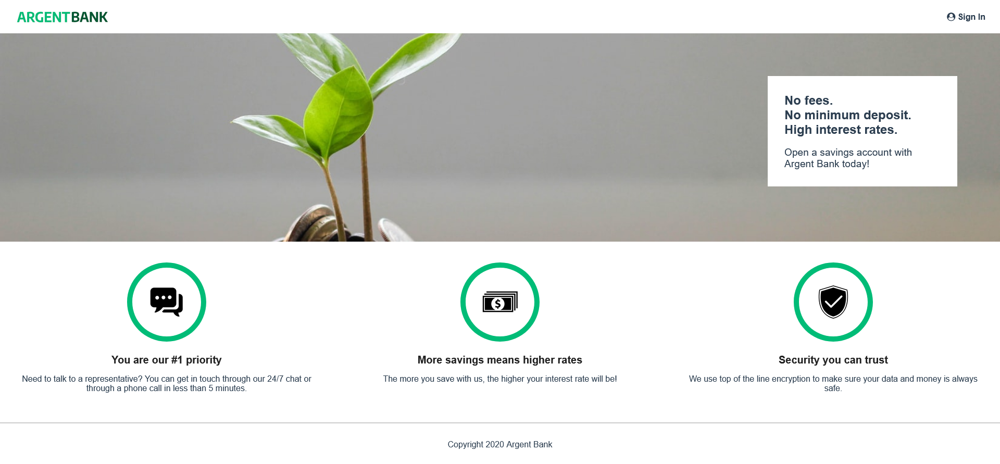
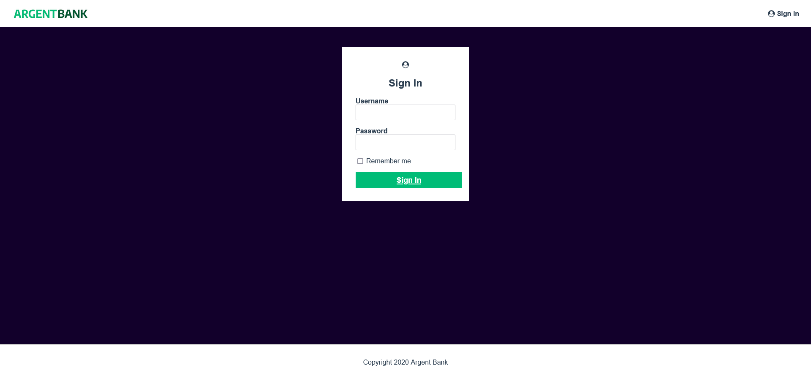
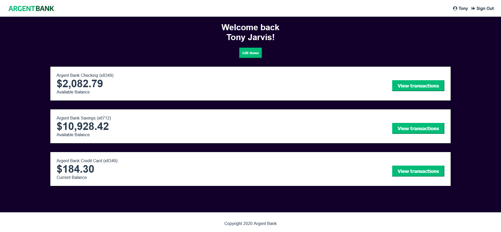

   
     

# Projet 13 - Utilisez le state manager Redux pour gérer l’état de vos applications

## Contexte du projet

Remede Agency est une agence spécialisée dans le développement d'applications web. 
L’entreprise a signé un nouveau contrat avec une banque, Argent Bank. Cette nouvelle banque veut percer dans le secteur et confie à l'agence la mise en place de son application.

## Mission du projet

Le projet se décompose en 2 phases :

- **Phase 1 - Authentification des utilisateurs :** créer l'application web permettant aux clients de se connecter et de gérer leurs comptes et leur profil

- **Phase 2 - Transactions :** proposer des endpoints API pour la future fonctionnalité concernant les transactions

## Technologies utilisées

- react : V18.2.0
- react-dom : V18.2.0
- react-router-dom : V6.14.2
- react-scripts : V5.0.1
- axios : V1.4.0
- redux : V4.2.1
- styled-components : V6.0.7
- [Create React App](https://github.com/facebook/create-react-app)

## Maquettes à respecter

Pour les maquettes, les designs sont données dans les fichiers HTML statiques et CSS fournis dans le repot suivant [Project-10-Bank-API](https://github.com/OpenClassrooms-Student-Center/Project-10-Bank-API/tree/master/designs).

### Page d'accueil

### Page de connexion

### Page de profil

## Notes et contraintes du projet

**Police :**

- Polices : Avenir

**Couleurs :**

- Vert : #00bc77
- Blanc : #FFFFFF
- Noir : #222
- Violet : #12002b

**Contraintes techniques :**

- Utiliser React, Redux et React-Redux
- Mettre en place une implémentation de Redux pour la gestion de l'état qui :
  - Utilise un magasin (store) pour gérer les données
  - Inclut des action(s) pour envoyer des informations
  - Utilise des réducteurs (reducers) pour gérer les changements d'état de l'application
- Utiliser Swagger pour créer la documentation pour les endpoints API
- Gérer les calls API : soit avec Fetch, soit Axios
- Créer un service à part pour les calls API

## Tester le projet

### Prérequis

- NodeJS (version 12.18)
- Yarn
- Éditeur de texte (VSCode etc.)

### Lancer le projet

- **Back-end :**
  Mettre en place le back-end en suivant les instructions suivantes : [Back-end Argent-Bank](https://github.com/OpenClassrooms-Student-Center/Project-10-Bank-API)

- **Front-end :**
  - Forker ou cloner le repot actuel : [Front-end Argent-Bank](https://github.com/Magma73/Projet-13-argent-bank)
  - Accéder au répertoire du projet et utiliser la commande `npm install` pour installer les dépendances du projet
  - Puis lancer la commande `npm start` pour ouvrir l'application dans le navigateur

[def]: /argent-bank//public/assets/img/HomePage.png
